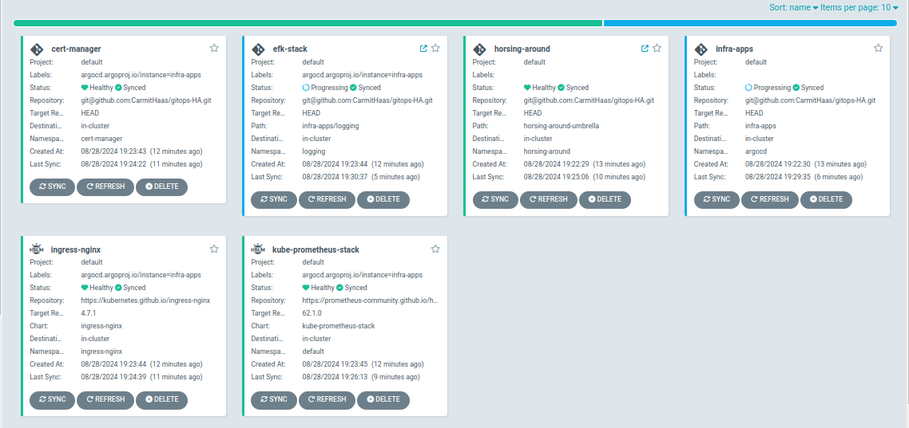
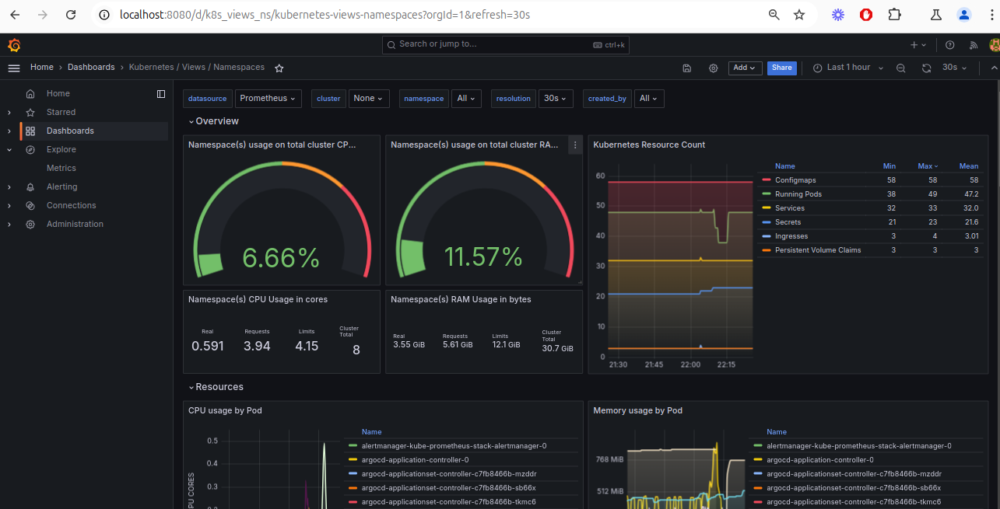

# Horsing Around - GitOps

ArgoCD GitOps configuration for the Horsing Around application. Uses the App-of-Apps pattern to manage both the application and infrastructure components on EKS.



## Related Repositories

- [Horsing-Around](https://github.com/CarmitHaas/Horsing-Around) - Application source code + Jenkins CI/CD
- [HA-infrastructure](https://github.com/CarmitHaas/HA-infrastructure) - Terraform EKS cluster

## What Gets Deployed

ArgoCD manages 6 applications via the App-of-Apps pattern:

| Application | Purpose | Namespace |
|-------------|---------|-----------|
| horsing-around | Flask app + MongoDB replica set (umbrella chart) | horsing-around |
| ingress-nginx | Ingress controller for external access | ingress-nginx |
| cert-manager | Automatic TLS certificates via Let's Encrypt | cert-manager |
| kube-prometheus-stack | Prometheus + Grafana monitoring | default |
| efk-stack | Elasticsearch + Fluent Bit + Kibana logging | logging |
| sealed-secrets | Encrypted secrets that can live in Git | kube-system |

## Repository Structure

```
├── horsing-around-argocd-app.yaml    # App + secrets ArgoCD applications
├── infra-app-of-apps.yaml            # Bootstrap: deploys all infra apps
├── infra-apps/                       # Individual infra app manifests
│   ├── applicationset.yaml
│   ├── cert-manager.yaml
│   ├── certificate.yaml
│   ├── cluster-issuer.yaml
│   ├── efk-stack.yaml
│   ├── ingress-controller.yaml
│   ├── kps.yaml                      # kube-prometheus-stack
│   ├── sealed-secrets-app.yaml
│   └── logging/
├── infra-apps-values/                # Helm values for infra apps
└── horsing-around-umbrella/          # Application umbrella chart
    ├── Chart.yaml
    ├── values.yaml
    ├── sealed-mongodb-secret.yaml
    └── charts/
        ├── horsing-around/           # App Helm chart
        └── mongodb/                  # MongoDB Helm chart
```

## Secrets Management

MongoDB credentials are managed using Bitnami SealedSecrets:
- Secrets are encrypted with the cluster's sealing key
- Encrypted secrets are safe to store in Git
- Only the cluster can decrypt them

## Prerequisites

- EKS cluster deployed via [HA-infrastructure](https://github.com/CarmitHaas/HA-infrastructure)
- ArgoCD installed (handled by the infrastructure Terraform)
- ECR repository with the application image

## Configuration

Before deploying, update `horsing-around-umbrella/values.yaml`:
- Set `deployment.image.repository` to your ECR URL
- Set `ingress.hosts` to your domain

## Deployment

ArgoCD is bootstrapped by Terraform. The bootstrap application points to this repo and syncs automatically. To manually apply:

```bash
kubectl apply -f infra-app-of-apps.yaml
kubectl apply -f horsing-around-argocd-app.yaml
```

## Monitoring



## Accessing Services

```bash
# Grafana
kubectl port-forward svc/kube-prometheus-stack-grafana 8080:80

# Kibana
kubectl port-forward svc/efk-stack-kibana 15601:5601 -n logging

# Prometheus
kubectl port-forward svc/kube-prometheus-stack-prometheus 9090:9090
```
